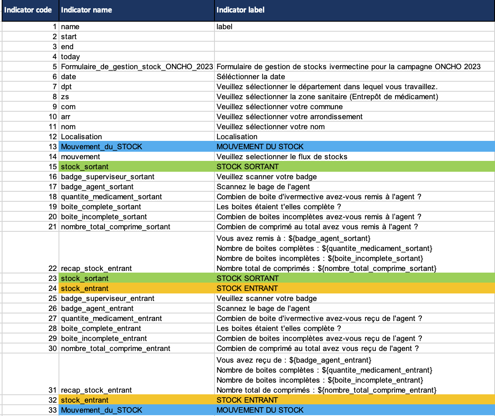

# **Program Overview**
Donated Drug Reporting Templates to Support Neglected Tropical Disease (NTD) Program Implementation WHO SMART Guidelines approach

## **1\. Program Name**

*Donated Drug Reporting Templates to Support Neglected Tropical Disease (NTD) Program*

## **2\. Sponsoring Organization(s)**

*John Snow, Inc.\[[link](https://www.jsi.com/)\] and Standard Co \[[link](https://www.standardco.de/)\], with financial support from the Bill & Melinda Gates Foundation \[[link](https://www.gatesfoundation.org/)\], conducted an assessment of the tools and processes used to manage, direct, use, report, and store last mile tools and processes used to manage donated medicines used for Neglected Tropical Disease (NTD) control and elimination programmes for the five PC-NTDs.*

## **3\. Geographic Coverage**

*While this project focused on evaluating the people, systems, and processes used to track last mile supply chain for Mass Drug Administration (MDA) donated medicines in eight priority countries (DRC, Ethiopia, Kenya, Madagascar, Mozambique, Nigeria, Tanzania, and Uganda), the recommendation templates are applicable for reporting inventory of MDA donated medicines in any country with considerations for unique country context.*

## **4\. Target Population**

*The target population for this tool is national NTD Program Managers, implementing NGO partners, and project sponsors. The timely reporting of data on donated medicines received, used, wasted, expired, and remaining, helps to ensure that the production and distribution of new medicines are delivered to sites around the world for distribution to endemic communities in the appropriate quantities.*

# **Alignment with WHO Smart Guidelines**

## **5\. WHO Recommendations for NTDs**

*In 2022, the World Health Organization (WHO) published the “Standard Operating Procedures for Supply Chain Management of Health Products for Neglected Tropical Diseases Amenable to Preventive Chemotherapy.” \[[link](https://www.who.int/publications/i/item/9789240049581?utm_source=chatgpt.com)\]  This document provides detailed procedures covering various aspects of supply chain management, including:*

* ***Forecasting and Quantification:** Accurate estimation of medicine requirements to prevent shortages or overstocking.*  
* ***Inventory Management:** Systematic tracking of stock levels to maintain optimal inventory.*  
* ***Storage and Distribution:** Proper storage conditions and timely distribution to ensure medicine efficacy.*  
* ***Reverse Logistics:** Processes for handling and reporting unused or expired medicines.*

*The mechanism for reporting medicines is through the Joint Application Package (JAP) \[[link](https://www.who.int/teams/control-of-neglected-tropical-diseases/interventions/strategies/preventive-chemotherapy/joint-application-package)\]. This package is a collection of forms and includes forms for reporting on medicines delivered through the Joint Reporting Form (JRF), and medicines needed for future treatments through the Joint Request for Select Medicines (JRSM). These forms are submitted to WHO by national NTD Program Managers annually. Forms are reviewed and submitted to pharmaceutical partners who produce the medicines and ship the medicines to countries for distribution to endemic communities.*

## **6\. Digital Adaptation Kit (DAK) Components**

### **Functional & Non-functional Requirement**

**Functional requirements**

[Web annex B](https://docs.google.com/spreadsheets/d/1yPYo4qOwWxHHD6ckmXrLE4VMVU0kWGPy/edit?usp=drive_link&ouid=104620825587987098442&rtpof=true&sd=true)

**Non-functional requirements** 

[Web annex B](https://docs.google.com/spreadsheets/d/1yPYo4qOwWxHHD6ckmXrLE4VMVU0kWGPy/edit?usp=drive_link&ouid=104620825587987098442&rtpof=true&sd=true)

### **Data Models and Exchange**

**Actors \- entities that interact with the system, derived from business requirements**

| Name | Administrative level | Description |
| :---- | :---- | :---- |
| Community member | Community | Target for MDA treatment |
| Community Health Worker (CHW) | Community | Distribute MDA and report data associated with treatments delivered. The system could be implemented at this level. |
| District Health Worker | District | District is the level of reporting treatments on annual reporting forms. This is the most likely level of implementing this system given the resources available at this level. |
| NTD Program Manager | National | Collect data from all districts and report these data on annual reporting forms. National level could produce reports from data reported by either community or district level. |
| WHO Country Office | National | Support national programs to complete annual reporting forms. Would have limited impact on this system. |
| WHO Regional Office | Regional | First review of annual reporting forms. If this level was given access to data collected by this system, annual reporting forms could be pre populated through integration. |
| WHO Central Office | Global | Final review of drug donation request. Would have limited use for this system. |
| Pharmaceutical company  | Global | Integration with this system would allow for early reporting of drugs used, wasted, and remaining. These data would improve forecasting for manufacturing. |
| International shipment company | Global | Would have limited impact on this system. However, the shipping information is available for integration with national systems and that data combined with reporting medicine stock would provide a comprehensive review of received, used, requested medicines. |
| Implementing partner | Global | Implementing partners would have no role in using this system. However, if they were given access to these data they too would have improved visibility on inventory and expiration. |

**List of indicators across multiple tools**

**Example list of indicators used by Clinton Health Access Initiative**

[Web annex A](https://docs.google.com/spreadsheets/d/1_NCdu7_UhALA5o2GEe1pdlWO8TMZLDX8/edit?usp=drive_link&ouid=104620825587987098442&rtpof=true&sd=true)

### **Workflows & Business Processes**

*The **first mile** refers to the initial stages of the supply chain, from the pharmaceutical manufacturers or donors to the national or regional distribution centers. For NTD programs, first mile supply chain processes can be tracked through NTDeliver \[[link](https://www.ntdeliver.com/about)\].*

*The **last mile** refers to the final stages of distribution, from national storage facilities to the community-level health workers or end-users. The activities and challenges associated with the last mile are the focus of this project and associated tools.*

***Key Activities:***

* ***Transport to Regional & Local Distribution Points:***  
  * *National storage centers distribute medicines to **regional or district health offices**.*  
* ***Community-Level Distribution (MDA Campaigns):***  
  * *Community drug distributors (CDDs), often volunteers, administer medicines directly to at-risk populations through **door-to-door**, school-based, or health center campaigns.*  
  * *Real-time tracking and **paper-based or digital recording** ensure **dosage compliance**.*  
* ***Reverse Logistics & Waste Management:***  
  * *Expired or unused drugs are collected, stored, and expired medicines are safely disposed of.*

*Weak monitoring and reporting systems can lead to **stockouts or over-distribution** of medicines. Most often, the medicines used for MDA campaigns are not tracked using national logistics management information systems as they move from ports of entry, to central storage, and, ultimately, out to endemic communities. Similarly, reporting of the use of these medicines is a component of paper-based community registers and treatment summary forms. Limiting the access to these data until weeks after the MDA has concluded.*

**General data flow at national and global level**

*The tools provided here support the electronic submission of drug distribution during, or immediately following the MDA to a central database where these data can be accessed by all key actors and used for program management, reporting, and planning.*

### **Reporting Specifications**

***XLSForm** \[[link](https://xlsform.org/en/#what-is-an-xlsform?)\] is a widely used open standard that ensures consistent implementation of advanced features like skip logic across various web and mobile data collection platforms. It enables users to author forms in a human-readable format with a familiar tool, Microsoft Excel, making collaboration and sharing more accessible. Tools that support XLSForms are commonly used in **humanitarian aid, public health, and development projects** due to their flexibility and interoperability.*

*Compatible web and mobile data collection platforms supporting XLSForm includes:*

* *Open Data Kit (ODK)*  
* *KoboToolbox*  
* *Enketo Web Forms*  
* *Ona*  
* *SurveyCTO*  
* *CommCare*  
* *EpiCollect5*  
* *Standard Data*

# **Data Management & Decision Support**

## **7\. Data Collection & Reporting**

*It is recommended that data are reported from whatever level is feasible given literacy, human resource constraints, and infrastructure constraints.* 

***Community level***

*Ideally, data on MDA medicines distribution would be submitted from endemic communities on a daily basis. This would allow program managers and supervisors to monitor the progress of MDA and to make critical decisions when inventory deficits and surpluses need to be moved around.* 

***Sub-district or district level***

*When community level reporting is not feasible, reporting would move to a higher administrative level, which would reduce the number of reporters, but also limit what actions could be taken with these data. Data submitted above the community level would primarily support the reporting of treatments delivered and remaining stock on annual reporting forms. These data could be made available to WHO and pharmaceutical partners, improving their ability to manufacture and ship medicines on time.*

**Dashboard example produced to report on drug used and remaining stock**

## **8\. Decision Support Artifacts**

*Decisions from these data include:*

* ***Forecasting and Quantification:** Accurate estimation of medicine requirements to prevent shortages or overstocking.*  
  * *Are the quantities of drugs in a community sufficient to treat the target population?*  
* ***Inventory Management:** Systematic tracking of stock levels to maintain optimal inventory.*  
  * *If a community has a surplus or deficit, can these drugs be moved to or from adjoining communities?*  
* ***Storage and Distribution:** Proper storage conditions and timely distribution to ensure medicine efficacy & **Reverse Logistics:** Processes for handling and reporting unused or expired medicines.*  
  * *What quantity of medicines will remain on hand after the MDA, where will they be stored, and will their expiration date allow them to be used in future MDA?*  
  * *Review of the quantities of drugs expiring to improve future distribution forecast*

# **Implementation & Integration**

## **9\. Digital Health Systems Integration**

*There are multiple opportunities for system integration between the tools presented here and national Health Information Management Systems (HMIS), Logistic Information Management Systems (LMIS), NTD databases or data repositories, and, at the global level, WHO and NTDeliver.*

## **10\. Monitoring & Evaluation Metrics**

*Data are likely reported by district or reported by sub-district and aggregated to district for WHO annual reporting forms.*

 *The key performance indicators (KPIs) for this tool are the following:*

* *Quantity of medical product(s) received*  
* *Quantity of medical product(s) use*  
* *Quantity of medical product(s) wasted*  
* *Quantity of medical product(s) expired*  
* *Quantity of medical product(s) remaining (calculated: received \- (used+wasted+expired))*  
* *Quantity of medical product(s) required for future treatments (calculated: needed \- remaining)*

*Reporting timelines:*

*Currently, inventory is reported once annually on the JAP annual reporting forms from countries to WHO. However, this cadence of reporting lacks interim visibility. Receiving all national drug requests at the same time places a burden on the manufacturing and shipment of donated medicines to endemic countries. The tools presented here provide an **opportunity to report quantities of medical products at the time of distribution**, providing greater visibility and the opportunity to integrate these data into manufacturing forecast models.*

# **References & Dependencies**

## **11\. WHO Guidelines & Resources**

* WHO Smart Guidelines: [Link](https://www.who.int/teams/digital-health-and-innovation/smart-guidelines)  
* WHO NTD Recommendations: [Link](https://www.who.int/teams/immunization-vaccines-and-biologicals)  
* Smart Guidelines References: [Link](https://worldhealthorganization.github.io/smart-example-immz/references.html)  
* Dependencies: [Link](https://worldhealthorganization.github.io/smart-example-immz/dependencies.html)

# **Web annexes**

* [Web annex A: Indicator table](https://docs.google.com/spreadsheets/d/1_NCdu7_UhALA5o2GEe1pdlWO8TMZLDX8/edit?usp=drive_link&ouid=104620825587987098442&rtpof=true&sd=true)  
* [Web annex B: Functional and non-functional requirements](https://docs.google.com/spreadsheets/d/1yPYo4qOwWxHHD6ckmXrLE4VMVU0kWGPy/edit?usp=drive_link&ouid=104620825587987098442&rtpof=true&sd=true)  
* [Web annex C: XSLForm used in pilot project in Kenya (note: admin units need to be updated if this is applied to other country context)](https://docs.google.com/spreadsheets/d/18xcrK_wMwJJSstOeqL9HhDiwwCOjuPxY/edit?usp=drive_link&ouid=104620825587987098442&rtpof=true&sd=true)
